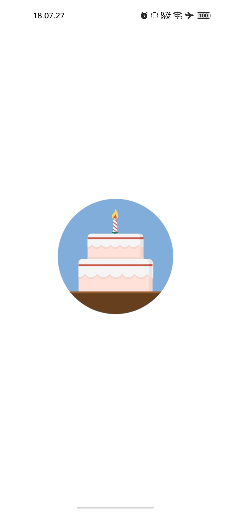
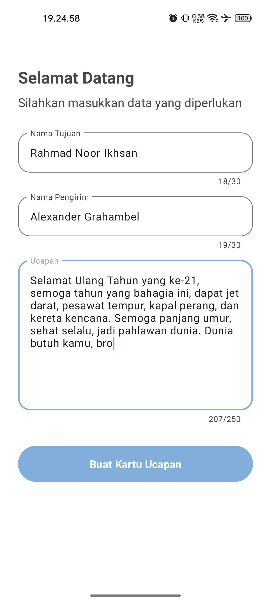
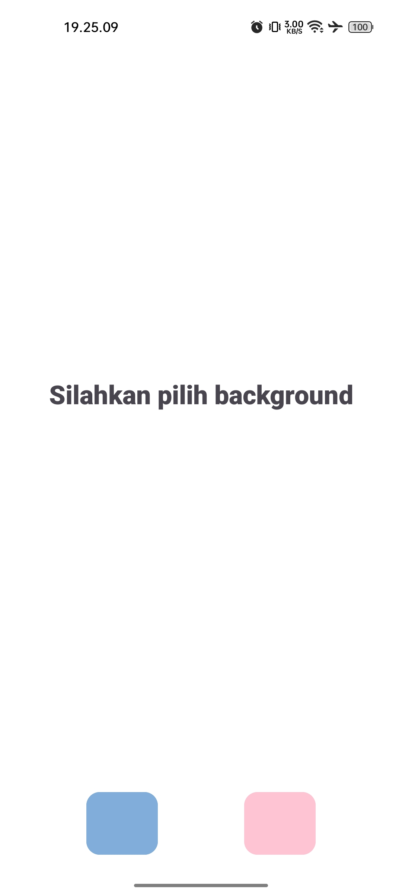
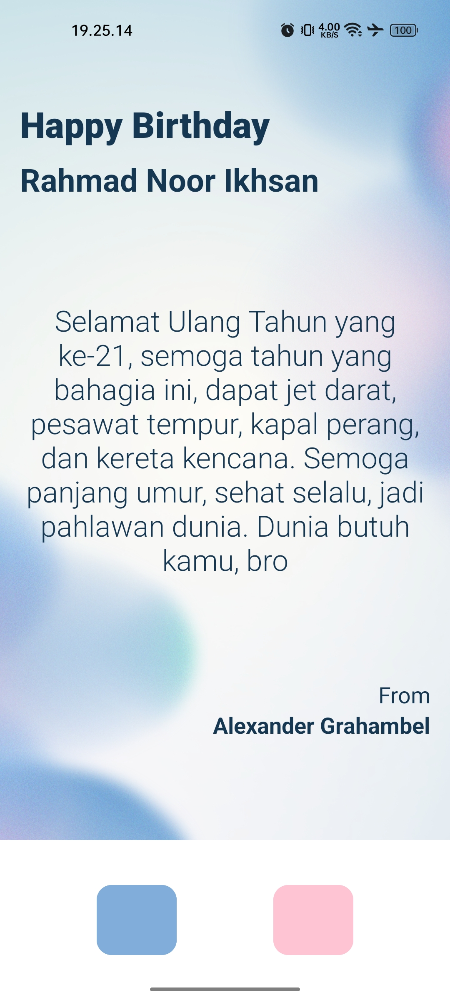
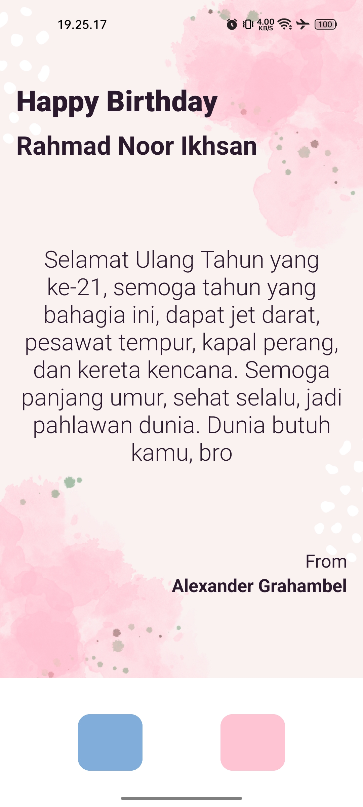

# Task 1 Android Fundamentaks RahmadNoorIkhsan MobileB Morning
This project is an Android Fundamentals Independent Study assignment at Infinite Learning, with criteria:
- Send data using Intent
- Display the sent data.
- Using Fragment

## Birthday Greeting
In this project I created an application to create a simple birthday greeting.

## Preview
<table>
    <tr>
        <td>
        <td>
        <td>
    </tr>
    <tr>
        <td>
         <td>
   </tr>
<table>
